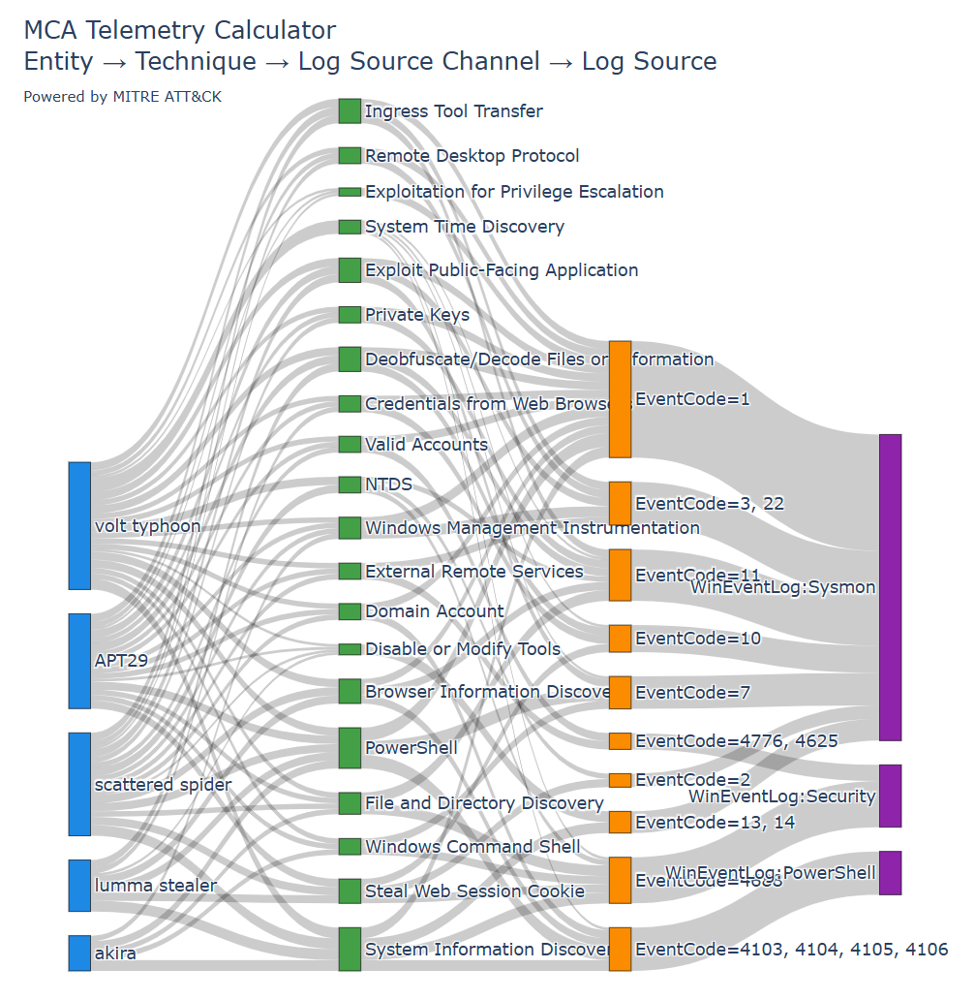
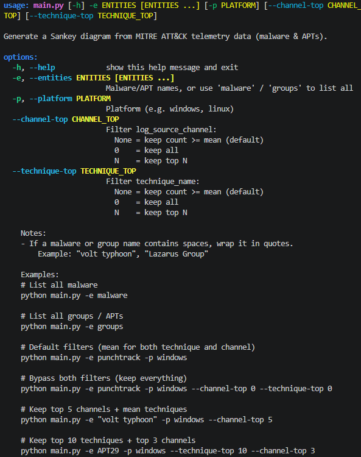

APT/MCA Telemetry Calculator (Powered by MITRE ATT&CK)

Advanced persistent threat (APT) or malicious cyber activity (MCA) telemetry calculator. A python project to consolidate MITRE ATT&CK techniques and visualize correlations with data sources. Intent is to encourage cyber analysts to ask what is being collected and why.

Warning: Only supports Windows at this time, will add other platforms in time.

python main.py --entities "volt typhoon" APT29 "scattered spider" akira "lumma stealer" --platform windows --channel-top 10 --technique-top 20

Usage: python main.py --help

